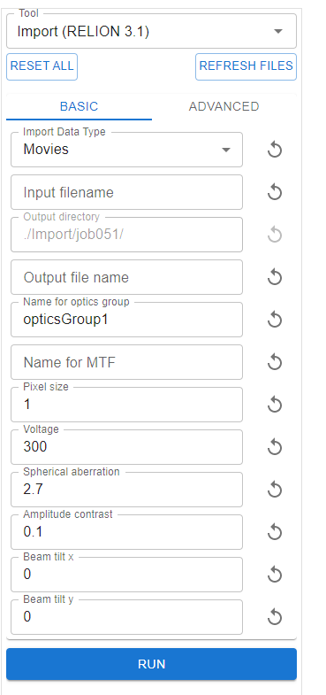
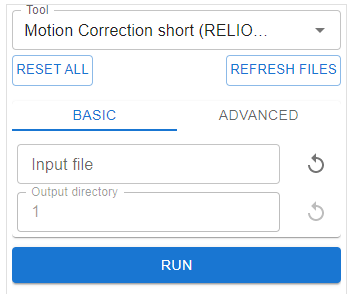
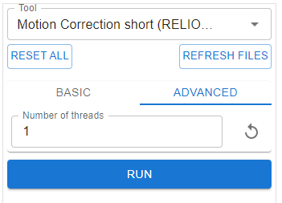

Creating/editing tools
======================

In cryoHub, all the available tools (commands) can be found in the ``Command Runner`` section:

In the file system, they are controlled by the YAML files in the directory
``cryohub-react/cryohub/commands/``.

By simply adding a new YAML file written for your own tool in this folder,
cryoHub will generate a corresponding GUI for you. You can also edit the existing
YAML files so that it suits your needs better.

Rules
-----
1. The added tool needs to be able to run from the command line.

2. cryoHub follows RELION's convention for project and job organization, for example: ``<project name>/Import/job001``

3. The command will be executed under the project directory.

4. If there is any files being outputted, an argument indicate the output directory will need to be specified. cryoHub will set this as ``./<command name>/jobxxx`` by default.

Example
-------

Here is a snippet of an example yaml file::

    name: MotionCorr
    custom_name: Motion Correction short (RELION 3.1)
    command: mpirun -np 32 -oversubscribe relion_run_motioncorr_mpi
    queue_id: cpu
    postprocess: echo ./corrected_micrographs.star
    file_postprocess: ls 
    arguments:
      - name: Input file
        arg: --i
        level: basic
        arg_type: file_path
        description: STAR file with all input micrographs, or a Linux wildcard with all micrographs to operate on

      - name: Output directory
        arg: --o
        level: basic
        arg_type: output_path
        description: Name for the output directory

      - name: Number of threads
        arg: --j
        level: advanced
        arg_type: int
        description: Number of threads per movie (= process)
        default: 1

The resulting UI in the ``Command Runner`` is:

  

The user can change the parameters from the UI.

By clicking ``Run``, the command ``mpirun np -32 -oversubscribe relion_run_motioncorr_mpi --i <input file> --o <output directory> --j <num of threads>`` 
will be executed from the project directory.

Whenever a new file is generated under this job directory, the ``file_postprocess`` command ``ls`` will take the new file path as the argument 
and will be executed from the job directory, e.g. ``ls <new file path>``.

The ``postprocess`` command ``echo ./corrected_micrographs.star`` will be executed after the main command is finished.

Detailed description of the YAML file
-------------------------------------

Overall
~~~~~~~

``name``: When running the command, the directory ``/<name>/jobxxx`` will be created. This ``name`` will also show on the job card.

``custom_name``: The name displayed from the dropdown selection menu.

``command``: The beginning of the command which will be executed. This ``command`` and the arguments below will be combined together to parse to a runnable command.

``queue_id``: The tools and jobs with the same ``queue_id`` will be launched sequentially instead of in parallel (default).

``postprocess``: The ``postprocess`` command runs after the job is complete.

``file_postprocess``: The ``file_postprocess`` command runs for each file generated by the job, and will be passed the path of the file as an argument.

Arguments
~~~~~~~~~

``name``: Name to be displayed in the UI.

``arg``: The flag which will be used to parse the final command to run.

``level``: Either "basic" or "advanced". Whether this argument will be shown in the basic or advanced tab.

``arg_type``: Supported arg_types are: str, int, float, bool, file_path, output_path, select. Details in the next section.

``description``: Tooltip that will be shown when mouse hovering.

``default``: Optional. The default value of this argument.

Supported arg_type
~~~~~~~~~~~~~~~~~~

``str``: String. Space is not allowed and will cause error.

``int``: Integer.

``float``: Decimal number.

``bool``: Boolean. If true, ``arg`` will be parsed into the command, otherwise not.

``file_path``: A file path. The corresponding UI will be a searchable dropdown menu including all the files and folder in the 
current project directory, and the inputFiles directory (``../../inputFiles/``). For security reasons, we do not allow this UI to access
the whole file system. However, if you know a valid path, you can override it by simply copy it to the box.

``output_path``: Always disabled, and will be ``../<tool name>/jobxxx``, where the job index is automatically incremented. 
It is highly recommended that each tool should have an argument with this arg_type as the output directory.

``select``: The corresponding UI is a selectable dropdown menu. An example usage is::
    - name: Import Data Type
    level: basic
    arg_type: select
    arg:
    default: --do_movies
    options:
      - name: Movies
        arg: --do_movies
        description: Import movies

      - name: Micrographs
        arg: --do_micrographs
        description: Import micrographs

When the user select an option, only the corresponding ``arg`` will be parsed into the command.